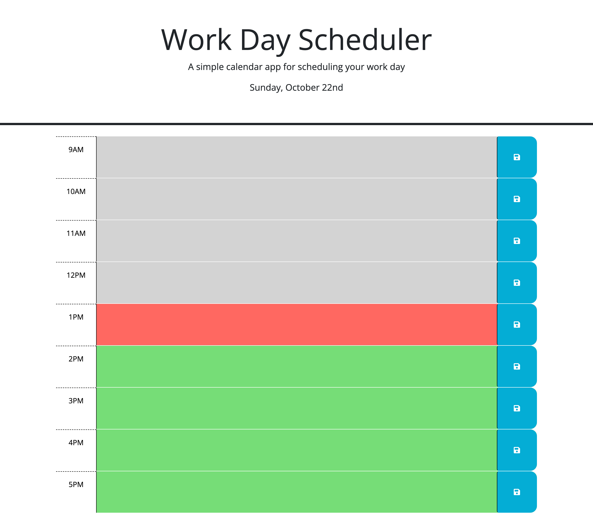

# work-day-scheduler

[Link to deployed application]()  
  

## Description

This application is a simple calendar that allows a user to save events for each hour of a typical working day (9am&ndash;5pm) by modifying a given starter starter code. This app will run in the browser and feature dynamically updated HTML and CSS powered by jQuery and using the [Day.js](https://day.js.org/en/) library for the day and time in the browser.

## User Story

AS AN employee with a busy schedule  
I WANT to add important events to a daily planner  
SO THAT I can manage my time effectively

## Acceptance Criteria

GIVEN I am using a daily planner to create a schedule  
WHEN I open the planner  
THEN the current day is displayed at the top of the calendar  
WHEN I scroll down  
THEN I am presented with timeblocks for standard business hours of 9am&ndash;5pm  
WHEN I view the timeblocks for that day  
THEN each timeblock is color coded to indicate whether it is in the past, present, or future  
WHEN I click into a timeblock  
THEN I can enter an event  
WHEN I click the save button for that timeblock  
THEN the text for that event is saved in local storage  
WHEN I refresh the page  
THEN the saved events persist

## Credits

[Bootcamspot.com](https://bootcampspot.instructure.com/courses/4347/assignments/62272?module_item_id=1081360)  
[github.com](https://github.com/)
